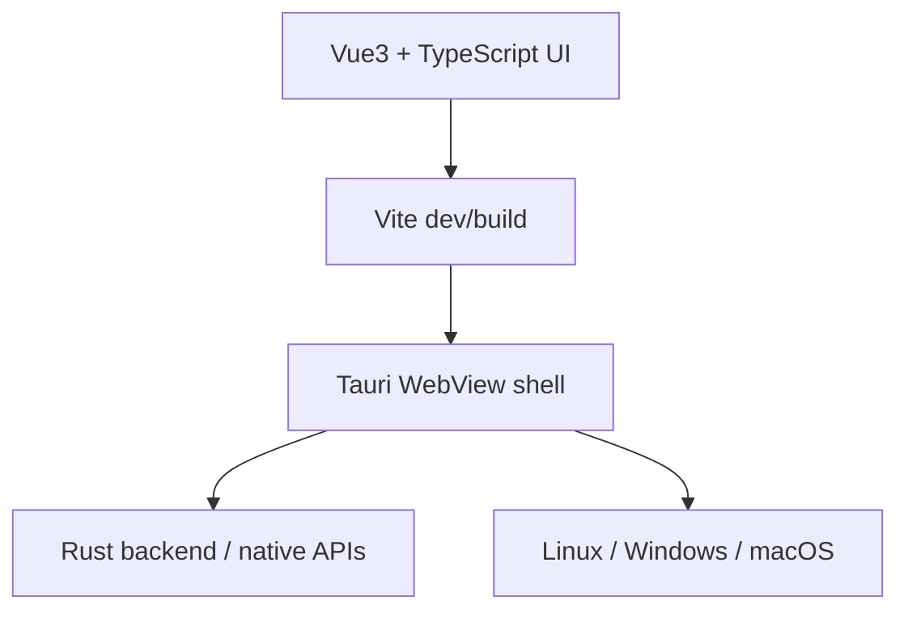

# Tauri 桌面应用开发

## 技术栈定位

`Vite + Vue3 + TypeScript + Tauri 2.0` 的结构可以理解为：



- Vue3 / TypeScript：写 UI 和前端逻辑。
- Vite：开发服务、热更新和前端打包。
- Tauri：把 Web UI 包成桌面应用，并通过 Rust 后端访问本地能力。
- Rust toolchain：编译 Tauri 后端和最终桌面程序。

## Ubuntu 开发环境

Tauri 在 Linux 上开发需要系统 WebView 和构建依赖。Ubuntu 20.04 上重点安装：

```bash
sudo apt update
sudo apt install libwebkit2gtk-4.1-dev build-essential curl wget file libxdo-dev libssl-dev libayatana-appindicator3-dev librsvg2-dev
```

再安装 Rust 和 Node.js：

```bash
curl --proto '=https' --tlsv1.2 -sSf https://sh.rustup.rs | sh
source ~/.cargo/env

# 推荐用 nvm 管 Node 版本
nvm install 18
nvm use 18
```

Tauri CLI：

```bash
cargo install tauri-cli --locked
```

## 创建项目

```bash
npx create-tauri-app --template vue my-app
cd my-app
```

Vue3 模板通常已经包含 TypeScript 支持；重点检查 `package.json`、`src-tauri/tauri.conf.json` 和 `tsconfig.json`。

## Linux 打包 Windows 的取舍

在 Ubuntu 上打包 Windows 10 应用可走 `cargo-xwin + x86_64-pc-windows-msvc`，但 Tauri 官方对部分跨编译路径有实验性提示。更稳的做法通常是：

1. 本地 Ubuntu 负责日常开发和 Linux 构建。
2. Windows 产物交给 GitHub Actions / CI 的 Windows runner。
3. 如果必须在 Ubuntu 本地跨编译，再配置 Windows target、`cargo-xwin`、NSIS 等工具。

本地跨编译大致路径：

```bash
rustup target add x86_64-pc-windows-msvc
cargo install --locked cargo-xwin
sudo apt install nsis lld llvm
npm run tauri build -- --runner cargo-xwin --target x86_64-pc-windows-msvc
```

输出通常在：

```text
target/x86_64-pc-windows-msvc/release/bundle/nsis/
```

## 风险和建议

- Windows 目标最好在 Windows 环境或 Windows CI runner 上验证。
- Linux 上无法原生运行 `.exe`，只能用 Wine 粗测，最终仍需真实 Windows 环境。
- WebView 行为可能存在平台差异，桌面应用要把系统版本、WebView 版本纳入测试矩阵。
- 安装器、签名、自动更新属于发布链路，后续可独立整理。
- Ubuntu 20.04 源里的 Node.js 版本偏旧，Vite / Vue3 / Tauri 项目优先用 `nvm` 固定 Node 18+，避免系统包版本和前端构建工具链不匹配。
- Linux 本地跨编译 Windows 产物时，`cargo-xwin` 会处理 Windows SDK；`XWIN_CACHE_DIR` 可用于复用 SDK 缓存，CI 或多项目环境里更有价值。
- NSIS / Windows 安装器链路比普通 Rust target 更脆弱；如果只是交付 Win10 安装包，优先让 Windows runner 负责最终构建、签名和冒烟测试。

## 参考

- [[桌面程序开发：Vite + Vue3 +TypeScript + Tauri 2.0|Tauri 桌面开发 raw source]]
- [Tauri v2 前提条件](https://v2.tauri.app/start/prerequisites/)
- [Tauri 项目创建](https://v2.tauri.app/start/create-project/)
- [Tauri Windows 安装程序](https://v2.tauri.app/distribute/windows-installer/)
- [Tauri GitHub Actions](https://github.com/tauri-apps/tauri-action)
- [cargo-xwin](https://github.com/rust-cross/cargo-xwin)
- [NVM](https://github.com/nvm-sh/nvm)
