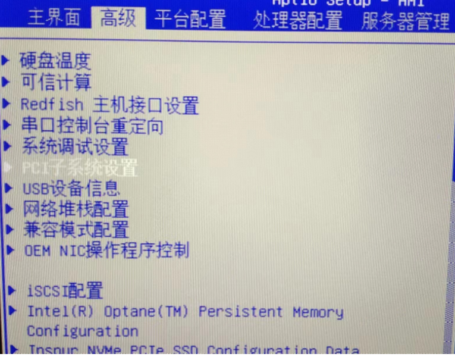
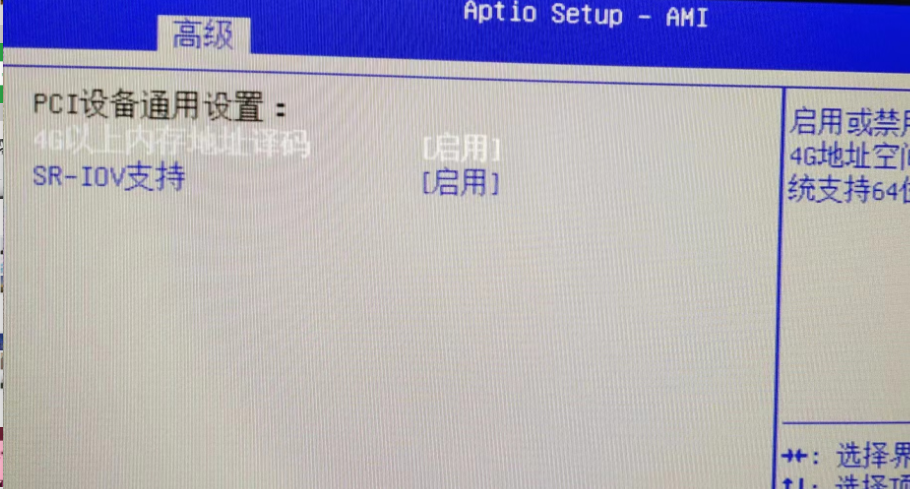
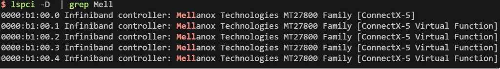

## SR-IOV 简介与 Docker-RDMA 配置指南

### 什么是 SR-IOV？

**SR-IOV（Single Root I/O Virtualization，单根 I/O 虚拟化）** 是一种硬件虚拟化技术，旨在通过将单个物理设备分割为多个虚拟功能（Virtual Functions，简称 VFs），实现多个虚拟机（VM）或容器对硬件资源的直接访问和共享。其核心思想是将一个物理功能（Physical Function，简称 PF）虚拟化为多个独立的 VFs，每个 VF 可以被分配给不同的 Docker 容器或虚拟机。

在 Docker 环境中，SR-IOV 的主要优势在于，容器可以直接访问物理设备（如 RDMA 网卡），绕过宿主机的网络堆栈，从而显著提升网络性能。这种技术特别适用于需要高带宽、低延迟的场景，例如高性能计算（HPC）、数据中心网络或分布式存储系统。

#### 关键特性
- **硬件直通**：容器直接与硬件通信，减少虚拟化开销
- **资源共享**：多个容器共享同一物理设备，提高资源利用率
- **高性能**：支持 RDMA（远程直接内存访问），适用于低延迟应用

### 配置要求

#### 1. 硬件要求
- RDMA 网卡：**`Mellanox Technologies MT27800 Family [ConnectX-5]`** 或其他支持 SR-IOV 的型号
- 主板和CPU需支持虚拟化技术

#### 2. BIOS 配置
- 启用 CPU 虚拟化支持（Intel VT-x/AMD-V）
- 启用 SR-IOV 支持



#### 3. 系统配置
- 安装 MLNX_OFED 驱动
- 在 GRUB 配置中添加：**`intel_iommu=on`**

#### 4. OpenSM 配置
- OpenSM 是 InfiniBand 子网管理器，需要启用虚拟化支持
- 配置文件路径：
  - MLNX OFED 4.x：`/etc/opensm/opensm.conf`
  - UFM 5.x/6.x：`/opt/ufm/files/conf/opensm/opensm.conf`
- 添加配置：
  ```bash
  virt_enabled 2
  ```
- 重启服务：`sudo systemctl restart opensm`

### 固件配置

#### 1. MST 工具配置
MST（Mellanox Software Tools）是用于管理 Mellanox 硬件设备的工具集，提供网卡诊断、固件更新、性能调优等功能。

```bash
# 启动 MST 服务
sudo mst start

# 查看设备状态
sudo mst status
MST modules:
------------
    MST PCI module is not loaded
    MST PCI configuration module loaded

MST devices:
------------
/dev/mst/mt4119_pciconf0         - PCI configuration cycles access.
                                   domain:bus:dev.fn=0000:b1:00.0 addr.reg=88 data.reg=92 cr_bar.gw_offset=-1
                                   Chip revision is: 00
```

#### 2. SR-IOV 固件配置

```bash
# 查询当前配置
sudo mlxconfig -d /dev/mst/mt4119_pciconf0 q

# 启用 SR-IOV 并设置 VF 数量
sudo mlxconfig -d /dev/mst/mt4119_pciconf0 set SRIOV_EN=1 NUM_OF_VFS=4
```

#### 3. 驱动配置

```bash
# 查看网卡状态
ibstat

# 查看当前 VF 数量
cat /sys/class/infiniband/mlx5_0/device/mlx5_num_vfs

# 设置 VF 数量为 4
echo 4 > /sys/class/infiniband/mlx5_0/device/mlx5_num_vfs
```

配置完成后，可以看到四个虚拟功能（VF）：


> **注意**：VF 数量设置在系统重启后会重置，需要考虑持久化配置。

#### 4. VF 策略配置

```bash
# 查看当前策略
cat /sys/class/infiniband/mlx5_0/device/sriov/0/policy

# 设置 VF 跟随 PF 状态
echo Follow > /sys/class/infiniband/mlx5_0/device/sriov/0/policy

# 验证配置
cat /sys/class/infiniband/mlx5_0/device/sriov/0/policy
```

### Docker 配置

#### 1. 安装必要组件

```bash
# 拉取 SR-IOV 插件镜像
sudo docker pull rdma/sriov-plugin

# 拉取容器工具安装器
sudo docker pull rdma/container_tools_installer
```

#### 2. 启动 SR-IOV 插件

```bash
sudo docker run -v /run/docker/plugins:/run/docker/plugins \
                -v /etc/docker:/etc/docker \
                -v /var/run:/var/run \
                --net=host --privileged rdma/sriov-plugin
```

#### 3. 创建 SR-IOV 网络

```bash
# 创建 SR-IOV 网络
docker network create -d sriov \
                     --subnet=10.10.1.0/24 \
                     -o netdevice=ibs21 \
                     sriov_net
```

#### 4. 启动测试容器

```bash
# 使用 SR-IOV 网络启动容器
sudo docker run -it \
                --net=sriov_net \
                --privileged \
                --ip=10.10.10.4 \
                --name lzq_ditto_0 \
                ditto_baseimage /bin/bash
```

### 参考资料

- [Docker Using SR-IOV - NVIDIA Networking Documentation](https://docs.nvidia.com/networking/display/mlnxofedv590590/docker+using+sr-iov)
- [Docker RDMA SR-IOV Networking Guide - NVIDIA Enterprise Support](https://enterprise-support.nvidia.com/s/article/Docker-RDMA-SRIOV-Networking-with-ConnectX4-ConnectX5-ConnectX6)"，以使其跟随 PF 的状态。
