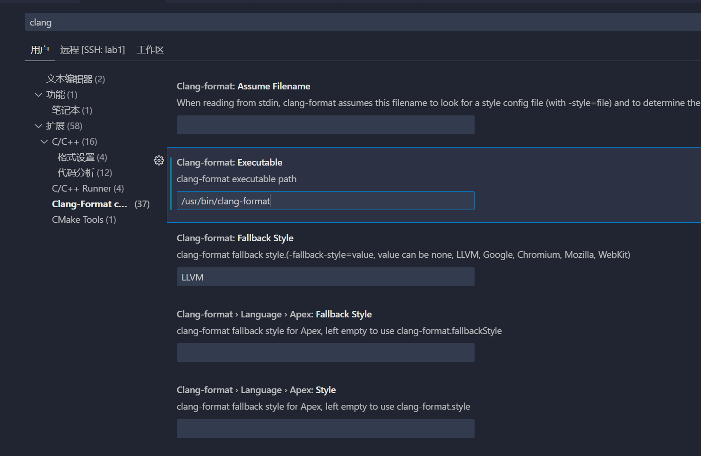
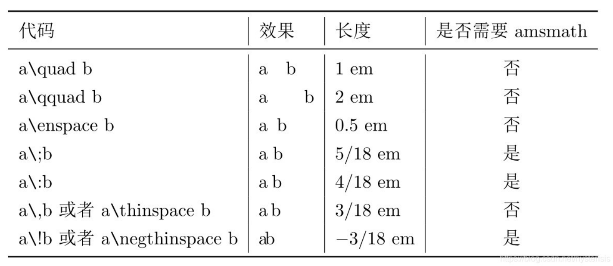
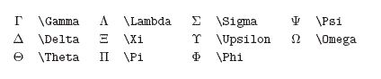

> 各种小工具
>
> 各种编辑器的插件配置。


# Vscode

**keybindings.json**

```json
// 将键绑定放在此文件中以覆盖默认值
[
    {
        "key": "alt+t",
        "command": "workbench.action.terminal.new",
        "when": "terminalProcessSupported || terminalWebExtensionContributedProfile"
    },
    {
        "key": "ctrl+shift+oem_3",
        "command": "-workbench.action.terminal.new",
        "when": "terminalProcessSupported || terminalWebExtensionContributedProfile"
    },
    {
        "key": "ctrl+t",
        "command": "workbench.action.closePanel"
    },
    // for vim ：按esc退出vim
    {
        "key": "escape",
        "command": "toggleVim",
        "when": "editorTextFocus && vim.mode == 'Disabled' || editorTextFocus && vim.mode == 'Normal'"
    },
]
```


**setting.json**

```json
{
    "workbench.sideBar.location": "left",
    "files.autoSave": "afterDelay",
    "liveServer.settings.donotShowInfoMsg": true,
    "explorer.confirmDelete": false,
    "tabnine.experimentalAutoImports": true,
    "launch": {
        "configurations": [],
        "compounds": []
    },
    "workbench.editorAssociations": {
        "*.ipynb": "jupyter.notebook.ipynb"
    },
    "C_Cpp.updateChannel": "Insiders",
    "workbench.iconTheme": "vscode-icons",
    "python.pythonPath": "D:\\environment\\python",
    "code-runner.runInTerminal": true,
    "code-runner.saveFileBeforeRun": true,
    "code-runner.executorMap": {
        "javascript": "node",
        "java": "cd $dir && javac $fileName && java $fileNameWithoutExt",
        "c": "cd $dir && gcc $fileName -o D:\\MyFile\\code\\out\\$fileNameWithoutExt && D:\\MyFile\\code\\out\\$dir$fileNameWithoutExt",
        "cpp": "cd $dir && g++ $fileName -o D:\\MyFile\\code\\out\\$fileNameWithoutExt && D:\\MyFile\\code\\out\\$dir$fileNameWithoutExt",
        "objective-c": "cd $dir && gcc -framework Cocoa $fileName -o $fileNameWithoutExt && $dir$fileNameWithoutExt",
        "php": "php",
        "python": "python -u",
        "perl": "perl",
        "perl6": "perl6",
        "ruby": "ruby",
        "go": "go run",
        "lua": "lua",
        "groovy": "groovy",
        "powershell": "powershell -ExecutionPolicy ByPass -File",
        "bat": "cmd /c",
        "shellscript": "bash",
        "fsharp": "fsi",
        "csharp": "scriptcs",
        "vbscript": "cscript //Nologo",
        "typescript": "ts-node",
        "coffeescript": "coffee",
        "scala": "scala",
        "swift": "swift",
        "julia": "julia",
        "crystal": "crystal",
        "ocaml": "ocaml",
        "r": "Rscript",
        "applescript": "osascript",
        "clojure": "lein exec",
        "haxe": "haxe --cwd $dirWithoutTrailingSlash --run $fileNameWithoutExt",
        "rust": "cd $dir && rustc $fileName && $dir$fileNameWithoutExt",
        "racket": "racket",
        "scheme": "csi -script",
        "ahk": "autohotkey",
        "autoit": "autoit3",
        "dart": "dart",
        "pascal": "cd $dir && fpc $fileName && $dir$fileNameWithoutExt",
        "d": "cd $dir && dmd $fileName && $dir$fileNameWithoutExt",
        "haskell": "runhaskell",
        "nim": "nim compile --verbosity:0 --hints:off --run",
        "lisp": "sbcl --script",
        "kit": "kitc --run",
        "v": "v run",
        "sass": "sass --style expanded",
        "scss": "scss --style expanded",
        "less": "cd $dir && lessc $fileName $fileNameWithoutExt.css",
        "FortranFreeForm": "cd $dir && gfortran $fileName -o $fileNameWithoutExt && $dir$fileNameWithoutExt",
        "fortran-modern": "cd $dir && gfortran $fileName -o $fileNameWithoutExt && $dir$fileNameWithoutExt",
        "fortran_fixed-form": "cd $dir && gfortran $fileName -o $fileNameWithoutExt && $dir$fileNameWithoutExt",
        "fortran": "cd $dir && gfortran $fileName -o $fileNameWithoutExt && $dir$fileNameWithoutExt"
    },
    "sml-environment-interpreter-path": "C:\\Program Files (x86)\\SMLNJ\\bin\\sml.bat",
    "terminal.integrated.env.windows": {},
    "sml.smlnj.path": "C:\\Program Files (x86)\\SMLNJ\\bin\\sml.bat",
    "arduino.path": "D:\\ArduinoAug_0.70.19_EXP",
    "arduino.commandPath": "arduino_debug.exe",
    "arduino.additionalUrls": [],
    "arduino.openPDEFiletype": true,
    "arduino.ignoreBoards": [],
    "C_Cpp.commentContinuationPatterns": [
        "/**"
    ],
    "update.mode": "none",
    "[json]": {
        "editor.quickSuggestions": {
            "strings": true
        },
        "editor.suggest.insertMode": "replace"
    },
    "gitlens.defaultDateShortFormat": null,
    "gitlens.defaultDateFormat": null,
    "gitlens.hovers.currentLine.over": "line",
    "gitlens.defaultTimeFormat": null,
    "latex-workshop.latex.tools": [
        {
            "name": "xelatex",
            "command": "xelatex",
            "args": [
                "-synctex=1",
                "-interaction=nonstopmode",
                "-file-line-error",
                "-pdf",
                "%DOCFILE%"
            ]
        },
        {
            "name": "pdflatex",
            "command": "pdflatex",
            "args": [
                "-synctex=1",
                "-interaction=nonstopmode",
                "-file-line-error",
                "%DOCFILE%"
            ]
        },
        {
            "name": "bibtex",
            "command": "bibtex",
            "args": [
                "%DOCFILE%"
            ]
        }
    ],
    "latex-workshop.latex.recipes": [
        {
            "name": "xelatex",
            "tools": [
                "xelatex"
            ]
        },
        {
            "name": "pdflatex",
            "tools": [
                "pdflatex"
            ]
        },
        {
            "name": "xe->bib->xe->xe",
            "tools": [
                "xelatex",
                "bibtex",
                "xelatex",
                "xelatex"
            ]
        },
        {
            "name": "pdf->bib->pdf->pdf",
            "tools": [
                "pdflatex",
                "bibtex",
                "pdflatex",
                "pdflatex"
            ]
        }
    ],
    "latex-workshop.view.pdf.viewer": "browser",
    "latex-workshop.view.pdf.external.viewer.command": "C:/Program Files (x86)/Adobe/Acrobat 2020/Acroba/Acroba.exe",
    "latex-workshop.view.pdf.external.viewer.args": [
        "-forward-search",
        "%TEX%",
        "%LINE%",
        "-reuse-instance",
        "-inverse-search",
        "\"D:/Microsoft VS Code/Code.exe\" \"D:/Microsoft VS Code/resources/app/out/cli.js\" -gr \"%f\":\"%l\"",
        "%PDF%"
    ],
    "latex-workshop.view.pdf.external.synctex.command": "C:/.../SumatraPDF.exe",
    "latex-workshop.view.pdf.external.synctex.args": [
        "-forward-search",
        "%TEX%",
        "%LINE%",
        "-reuse-instance",
        "-inverse-search",
        "\"D:/Microsoft VS Code/Code.exe\" \"D:/Microsoft VS Code/resources/app/out/cli.js\" -gr \"%f\":\"%l\"",
        "%PDF%",
        "resources/app/out/cli.js"
    ],
    "latex-workshop.message.error.show": false,
    "latex-workshop.message.warning.show": false,
    "debug.allowBreakpointsEverywhere": true,
    "fileheader.customMade": {
        "Author": "git config user.name && git config user.email",
        "Date": "Do not edit",
        "LastEditors": "git config user.name && git config user.email",
        "LastEditTime": "Do not edit",
        "Description": "",
        "custom_string_obkoro1": ""
    },
    "fileheader.cursorMode": {
        "description": "",
        "param": "",
        "return": ""
    },
    "editor.suggestSelection": "recentlyUsedByPrefix",
    "explorer.confirmDragAndDrop": false,
    "C_Cpp.intelliSenseCacheSize": 512,
    "files.autoGuessEncoding": true,
    "diffEditor.ignoreTrimWhitespace": false,
    "editor.wordWrap": "on",
    "merge-conflict.decorators.enabled": false,
    "workbench.colorTheme": "PyCharm Dark Theme",
    "verilog.ctags.path": "D:\\environment\\ctags",
    "editor.fontSize": 16,
    "markdown.marp.exportType": "pptx",
    "[markdown]": {
        "editor.wordWrap": "on",
        "editor.quickSuggestions": {
            "comments": "off",
            "strings": "off",
            "other": "off"
        }
    },
    "markdown.styles": [
        "C:\\\\Users\\\\26557\\\\AppData\\\\Roaming\\\\Typora\\\\themes\\\\vue"
    ],
    "markdown.marp.themes": [
        "C:\\\\Users\\\\26557\\\\AppData\\\\Roaming\\\\Typora\\\\themes\\\\vue"
    ],
    "vsicons.dontShowNewVersionMessage": true,
    "security.workspace.trust.untrustedFiles": "open",
    "remote.SSH.remotePlatform": {
        "222.20.97.186": "linux",
        "MyServer": "linux",
        "Lab-1": "linux",
        "HiDevLab-3": "linux"
    },
    "workbench.editor.empty.hint": "hidden",
    "sshfs.configs": [
        {
            "name": "lab1-50",
            "host": "222.20.97.186",
            "label": "Lab1-50",
            "group": "Lab",
            "port": 45033,
            "username": "lzq",
            "password": "1209"
        },
        {
            "name": "lab2-51",
            "host": "222.20.97.186",
            "port": 45034,
            "username": "root",
            "password": "qwer1234",
            "group": "Lab",
            "label": "Lab2-51"
        },
        {
            "name": "my-server",
            "host": "221.9.165.166",
            "username": "liuziqi",
            "password": "1209",
            "label": "my-server",
            "group": "my-server",
            "port": 22
        }
    ],
    "cmake.pinnedCommands": [
        "workbench.action.tasks.configureTaskRunner",
        "workbench.action.tasks.runTask"
    ],
    "makefile.configureOnOpen": true,
    "editor.formatOnSave": true,
    "workbench.settings.applyToAllProfiles": [
        "editor.formatOnSave",
        "bookmarks.saveBookmarksInProject",
        "bookmarks.useWorkaroundForFormatters",
        "bookmarks.label.suggestion"
    ],
    "files.exclude": {
        "**/.trunk/*actions/": true,
        "**/.trunk/*logs/": true,
        "**/.trunk/*notifications/": true,
        "**/.trunk/*out/": true,
        "**/.trunk/*plugins/": true
    },
    "files.watcherExclude": {
        "**/.trunk/*actions/": true,
        "**/.trunk/*logs/": true,
        "**/.trunk/*notifications/": true,
        "**/.trunk/*out/": true,
        "**/.trunk/*plugins/": true
    },
    "[shellscript]": {
        "editor.defaultFormatter": "foxundermoon.shell-format"
    },
    "bookmarks.saveBookmarksInProject": true,
    "bookmarks.useWorkaroundForFormatters": true,
    "bookmarks.label.suggestion": "useWhenSelected",
    "window.menuBarVisibility": "classic",
    "C_Cpp.intelliSenseUpdateDelay": 500,
    // vim 设置
    "vim.easymotion": true,
    "vim.incsearch": true,
    "vim.useSystemClipboard": true,
    "vim.useCtrlKeys": true,
    "vim.hlsearch": true,
    "vim.insertModeKeyBindings": [
        {
            "before": [
                "j",
                "j"
            ],
            "after": [
                "<Esc>"
            ]
        }
    ],
    "vim.normalModeKeyBindingsNonRecursive": [
        {
            "before": [
                "<leader>",
                "d"
            ],
            "after": [
                "d",
                "d"
            ]
        },
        {
            "before": [
                "<C-n>"
            ],
            "commands": [
                ":nohl"
            ]
        },
        {
            "before": [
                "K"
            ],
            "commands": [
                "lineBreakInsert"
            ],
            "silent": true
        }
    ],
    "vim.leader": "<space>",
    "vim.handleKeys": {
        "<C-a>": false,
        "<C-f>": false
    },
    "extensions.experimental.affinity": {
        "vscodevim.vim": 1
    }
}
```


## vscdoe.Clang-format

在服务器安装：

```bash
sudo apt install clang-format 
```

记得在vscode配置 format on save




.clang-format文件：

```
---
Language: Cpp
# 基础样式配置
BasedOnStyle: Google
Standard: Cpp11

# 缩进配置
IndentWidth: 4
TabWidth: 4
UseTab: Never
AccessModifierOffset: -4
IndentCaseLabels: true
NamespaceIndentation: None

# 行长度和换行配置
ColumnLimit: 120
AlignAfterOpenBracket: Align
AllowAllParametersOfDeclarationOnNextLine: true
BinPackArguments: false
BinPackParameters: false
AlwaysBreakTemplateDeclarations: Yes

# 大括号配置
BreakBeforeBraces: Custom
BraceWrapping:
  AfterClass: false
  AfterControlStatement: false
  AfterEnum: false
  AfterFunction: false
  AfterNamespace: false
  AfterStruct: false
  AfterUnion: false
  BeforeCatch: false
  BeforeElse: false
  IndentBraces: false

# 空格配置
SpaceBeforeParens: ControlStatements
SpaceInEmptyParentheses: false
SpacesInParentheses: false
SpacesInSquareBrackets: false
SpacesInAngles: false
SpaceAfterCStyleCast: false
SpaceAfterTemplateKeyword: true
SpaceBeforeAssignmentOperators: true
SpaceBeforeRangeBasedForLoopColon: true

# 对齐配置
AlignConsecutiveAssignments: true
AlignConsecutiveDeclarations: true
AlignEscapedNewlines: Left
AlignOperands: true
AlignTrailingComments: true

# 指针和引用配置
DerivePointerAlignment: false
PointerAlignment: Right

# 注释配置
CommentPragmas: '^[^ ]'  # 保持以非空格开始的注释的格式
FixNamespaceComments: true
ReflowComments: false     # 防止注释被自动重排
SpacesBeforeTrailingComments: 2
AlignTrailingComments: true

# 函数配置
AllowShortFunctionsOnASingleLine: Empty
AlwaysBreakAfterReturnType: None
BreakConstructorInitializers: BeforeColon
ConstructorInitializerAllOnOneLineOrOnePerLine: true

# 短语句配置
AllowShortBlocksOnASingleLine: true
AllowShortIfStatementsOnASingleLine: true
AllowShortLoopsOnASingleLine: true

# 其他配置
Cpp11BracedListStyle: true
IndentPPDirectives: None
KeepEmptyLinesAtTheStartOfBlocks: false
MaxEmptyLinesToKeep: 2

# 排序和对齐
SortIncludes: true
IncludeBlocks: Preserve
AlignConsecutiveMacros: true
BreakBeforeBinaryOperators: NonAssignment

```


## Latex-workshop

配置:

```json
"latex-workshop.latex.tools": [
        {
            // 编译工具和命令
            "name": "xelatex",
            "command": "xelatex",
            "args": [
                "-synctex=1",
                "-interaction=nonstopmode",
                "-file-line-error",
                "-pdf",
                "%DOCFILE%"
            ]
        },
        {
            "name": "pdflatex",
            "command": "pdflatex",
            "args": [
                "-synctex=1",
                "-interaction=nonstopmode",
                "-file-line-error",
                "%DOCFILE%"
            ]
        },
        {
            "name": "bibtex",
            "command": "bibtex",
            "args": [
                "%DOCFILE%"
            ]
        },
        {
            "name": "biber",
            "command": "biber",
            "args": [
                "%DOCFILE%"
            ]
        }
    ],
    // 设置编译方法
    "latex-workshop.latex.recipes": [
        {
            "name": "xelatex",
            "tools": [
                "xelatex"
            ],
        },
        {
            "name": "pdflatex",
            "tools": [
                "pdflatex"
            ]
        },
        {
            "name": "xe->biber->xe->xe",
            "tools": [
                "xelatex",
                "biber",
                "xelatex",
                "xelatex"
            ]
        },
        {
            "name": "pdf->biber->pdf->pdf",
            "tools": [
                "pdflatex",
                "biber",
                "pdflatex",
                "pdflatex"
            ]
        },
        {
            "name": "xe->bib->xe->xe",
            "tools": [
                "xelatex",
                "bibtex",
                "xelatex",
                "xelatex"
            ]
        }
    ],
    "latex-workshop.view.pdf.viewer": "tab",
    "latex-workshop.view.pdf.internal.synctex.keybinding": "ctrl-click",
    "latex-workshop.view.pdf.external.viewer.command": "C:/Program Files (x86)/Adobe/Acrobat 2020/Acroba/Acroba.exe",
    "latex-workshop.view.pdf.external.viewer.args": [
        "-forward-search",
        "%TEX%",
        "%LINE%",
        "-reuse-instance",
        "-inverse-search",
        "\"D:/Microsoft VS Code/Code.exe\" \"D:/Microsoft VS Code/resources/app/out/cli.js\" -gr \"%f\":\"%l\"",
        "%PDF%"
    ],
    "latex-workshop.view.pdf.external.synctex.command": "C:/.../SumatraPDF.exe",
    "latex-workshop.view.pdf.external.synctex.args": [
        "-forward-search",
        "%TEX%",
        "%LINE%",
        "-reuse-instance",
        "-inverse-search",
        "\"D:/Microsoft VS Code/Code.exe\" \"D:/Microsoft VS Code/resources/app/out/cli.js\" -gr \"%f\":\"%l\"",
        "%PDF%",
        "resources/app/out/cli.js"
    ],
    "latex-workshop.message.error.show": false,
    "latex-workshop.message.warning.show": false,
    // "latex-workshop.latex.autoClean.run": "onBuilt",
    // "latex-workshop.latex.clean.fileTypes": [
    //     "*.bbl",
    //     "*.blg",
    //     "*.idx",
    //     "*.ind",
    //     "*.lof",
    //     "*.lot",
    //     "*.toc",
    //     "*.acn",
    //     "*.acr",
    //     "*.alg",
    //     "*.glg",
    //     "*.glo",
    //     "*.gls",
    //     "*.ist",
    //     "*.fls",
    //     "*.fdb_latexmk"
    // ],
    // --latex-workshop@lzq
```


## 其他插件

**代码**

- **跳转**
  - IntelliCode（跳转）
  - Bookmarks（在代码的某行打标签快速跳转）
  - （看函数调用关系图）
- CodeLLDB（这个debug貌似比GDB好一点）
- Todo Tree - Gruntfuggly: TODO 软件	
- TabOut：按tab自动从括号里出来

**美化**

- Bracket（彩虹括号，两个对应的括号之间有竖线）
- Better Comments（注释上色）
- vscode-icon（最显眼的图标）
- Error Lens（在行内显示output，包括报错，提示）
- Output Colorizer


- Rainbow CSV
- Image preview

**其他：**

- 
- 合集：VSC-Essentials（少）
- 合集：VSCode Essentials（多）			
- 主题：
  - Dracula Theme Official（这个主题颜色比较丰富）


## LATEX插件

使用vscode本地编译LaTeX，需要先手动安装texlive

windows直装:https://www.tug.org/texlive/windows.html#install

插件：LaTeX Workshop，配置tex路径。


## vscode-vim

改一下keyboard.json，新增esc可以退出vim模式（再按ESC进入VIM normal模式）。这样就不会和vscode的快捷键冲突了。


# Cursor

可以继承Vscode绝大部分插件，但是有一些AI的配置和提示词：

Cursor Rules

```
# 持久记忆我的规则： 
1. 最小修改：如果你的任务是在现有代码上做修改，或新增功能。首先要学习现有数据结构，尽量不要新增冗杂的变量， 也不要新创建不必要的文件，优先利用现有方法实现，以最小的代价实现我需要的功能。 

2. 优先注释而不是删除：当你想删除代码时，对该行打注释符号即可，而不是直接删除代码。

3. TODO标签：必要时，要打上”TODO“ 标签，让我人工检查：如果不确定是否正确，或者是特定参数，比如路径名，设备名，

4. 追加README文档：整理md文档时，不要删除原有内容，不需要冗杂的上下文，直接写关键信息，如果不知道插入到哪，直接追加。

5. 追加AI记忆文档——README4ai.md：为了防止你忘记， 你可以（甚至主动地）把当前项目的状态和基本信息，写入到README4ai.md 供你自己下次阅读，用你自己最高效的方法记录，不需要考虑人的阅读。


# 环境辨析：
我一般会在笔记本打开cursor编辑代码，但是在远端服务器（通常是Linux）执行，启用Agent时要注意路径问题。

与用户用中文进行简明扼要的交流

# C++ Development Rules

    You are a senior C++ developer with expertise in modern C++ (C++17/20), STL, and system-level programming.

    ## Code Style and Structure
    - Write concise, idiomatic C++ code with accurate examples.
    - Follow modern C++ conventions and best practices.
    - Use object-oriented, procedural, or functional programming patterns as appropriate.
    - Leverage STL and standard algorithms for collection operations.
    - Use descriptive variable and method names (e.g., 'isUserSignedIn', 'calculateTotal').
    - Structure files into headers (*.hpp) and implementation files (*.cpp) with logical separation of concerns.

    ## Naming Conventions
    - Use PascalCase for class names.
    - Use camelCase for variable names and methods.
    - Use SCREAMING_SNAKE_CASE for constants and macros.
    - Prefix member variables with an underscore or m_ (e.g., `_userId`, `m_userId`).
    - Use namespaces to organize code logically.
    ## C++ Features Usage

    - Prefer modern C++ features (e.g., auto, range-based loops, smart pointers).
    - Use `std::unique_ptr` and `std::shared_ptr` for memory management.
    - Prefer `std::optional`, `std::variant`, and `std::any` for type-safe alternatives.
    - Use `constexpr` and `const` to optimize compile-time computations.
    - Use `std::string_view` for read-only string operations to avoid unnecessary copies.

    ## Syntax and Formatting
    - Follow a consistent coding style, such as Google C++ Style Guide or your team’s standards.
    - Place braces on the same line for control structures and methods.
    - Use clear and consistent commenting practices.

    ## Error Handling and Validation
    - Use exceptions for error handling (e.g., `std::runtime_error`, `std::invalid_argument`).
    - Use RAII for resource management to avoid memory leaks.
    - Validate inputs at function boundaries.
    - Log errors using a logging library (e.g., spdlog, Boost.Log).

    ## Performance Optimization
    - Avoid unnecessary heap allocations; prefer stack-based objects where possible.
    - Use `std::move` to enable move semantics and avoid copies.
    - Optimize loops with algorithms from `<algorithm>` (e.g., `std::sort`, `std::for_each`).
    - Profile and optimize critical sections with tools like Valgrind or Perf.

    ## Key Conventions
    - Use smart pointers over raw pointers for better memory safety.
    - Avoid global variables; use singletons sparingly.
    - Use `enum class` for strongly typed enumerations.
    - Separate interface from implementation in classes.
    - Use templates and metaprogramming judiciously for generic solutions.

    ## Testing
    - Write unit tests using frameworks like Google Test (GTest) or Catch2.
    - Mock dependencies with libraries like Google Mock.
    - Implement integration tests for system components.

    ## Security
    - Use secure coding practices to avoid vulnerabilities (e.g., buffer overflows, dangling pointers).
    - Prefer `std::array` or `std::vector` over raw arrays.
    - Avoid C-style casts; use `static_cast`, `dynamic_cast`, or `reinterpret_cast` when necessary.
    - Enforce const-correctness in functions and member variables.

    ## Documentation
    - Write clear comments for classes, methods, and critical logic.
    - Use Doxygen for generating API documentation.
    - Document assumptions, constraints, and expected behavior of code.

    Follow the official ISO C++ standards and guidelines for best practices in modern C++ development.

```


# Sealos Devbox 云开发

 [Sealos Devbox 云开发](https://www.cnblogs.com/ryanyangcs/p/18602214 "发布于 2024-12-12 13:06")

一键启动开发环境，单核2G 6毛一天


# Typora

> 直接copy现有的主题文件夹就行了

显示宽度，


修改汉字、英文的字体样式，


## Typora一些操作

`$$`+回车创建公式块

 ` ``` ` + 语种 + 回车 创建代码块 // Ctrl+Shift+K

## 格式控制

间隔：`\quad`	$A \quad B$




公式的**左对齐**:

&(对齐点) \\\\(换行)

```
\begin{align*}
	& \\
	& \\
\end{align*}
```


$$
\begin{align*}
  & X(0) = x(0)W_{N}^{0\cdot0} + x(1)W_{N}^{0\cdot1} + \cdots + x(N-1)W_{N}^{0\cdot(N-1)}\\
  & X(1) = x(0)W_{N}^{1\cdot0} + x(1)W_{N}^{1\cdot1} + \cdots + x(N-1)W_{N}^{1\cdot(N-1)} \\
  & \cdots \\
  & X(N-1) = x(0)W_{N}^{(N-1)\cdot0} + x(1)W_{N}^{(N-1)\cdot1} + \cdots + x(N-1)W_{N}^{(N-1)\cdot(N-1)} \\
\end{align*}
$$


## **角标**				

`_`是右下角,`^`是左上角

`\limits + _ 或 ^` 

$opt(i,l)=\bigcup\limits _{1 \leq j \leq l} \{opt(i,l-j) \times opt(l-j+i,j)\}$
## 数学符号

点乘：` \cdot`			$a \cdot b$

叉乘：`\times`		$a \times b$

除以：`\div`   	 	$a \div b$

大于等于：`\geq` 	$\geq$

小于等于：`\leq` 	$\leq$

分式:`\frac{分子}{分母}` 	$\frac{分子}{分母}$

### 逻辑符号

|                   |                |                 |
| ----------------- | -------------- | --------------- |
| $\oplus$          | 异或           | \oplus          |
| $\bar S$          | 均值(一bar~)   | \bar            |
| $\neg$            | 非             | \neg            |
| $\vee$            | 析取           | \vee            |
| $\wedge$          | 合取           | \wedge          |
| $\rightarrow$     | 若p则q(右箭头) | \rightarrow     |
| $\leftrightarrow$ | 等价(左右箭头) | \leftrightarrow |
|                   |                |                 |

A \subseteq B
## 希腊

$\Sigma$


## **花括号**

`\usepackage{amsmath}`

```LaTeX
 opt(i,1) =\left\{
\begin{aligned}
x & = & \cos(t) \\
y & = & \sin(t) \\
z & = & \frac xy
\end{aligned}
\right.
```


$opt(i,1) =\left\{  \begin{aligned}AC \\B\end{aligned}\right.$


## **无穷符号**

`\infty`

$\infty$


# EasyN2N——虚拟局域网


windows端用EasyN2N客户端


服务器用apt-get install n2n  


```bash
vim /etc/n2n/supernode.conf # -p=7777 设置端口号

sudo systemctl start supernode

sudo systemctl enable supernode

Created symlink /etc/systemd/system/multi-user.target.wants/supernode.service → /etc/systemd/system/supernode.service.
```


# Syncthing——文件P2P同步器

Linux版:

[https://apt.syncthing.net/](https://apt.syncthing.net/)

https://www.cnblogs.com/HaiJaine/p/18339629

[CSDN配置教程](https://blog.csdn.net/weixin_42951763/article/details/140421699?spm=1001.2101.3001.6650.2&utm_medium=distribute.pc_relevant.none-task-blog-2%7Edefault%7Ebaidujs_baidulandingword%7ECtr-2-140421699-blog-139358421.235%5Ev43%5Epc_blog_bottom_relevance_base8&depth_1-utm_source=distribute.pc_relevant.none-task-blog-2%7Edefault%7Ebaidujs_baidulandingword%7ECtr-2-140421699-blog-139358421.235%5Ev43%5Epc_blog_bottom_relevance_base8&utm_relevant_index=5)


**GUI：** 

syncthing serve --gui-address=0.0.0.0:8384  

ufw allow 8384 （允许远程访问这个GUI）

**隐藏运行:** 

nohup syncthing --gui-address=0.0.0.0:8384   &> /dev/null &

**自启动：**

\#添加开机启动 systemctl enable syncthing@root.service 
\#启动syncthing服务 systemctl start syncthing@root.service


# TODO: Clash-for-linux 

https://github.com/Elegycloud/clash-for-linux-backup


浏览器端口:http:// \<ip>:9090/ui

通过浏览器访问 `start.sh` 执行成功后输出的地址，例如：http://192.168.0.1:9090/ui

- 登录管理界面

在`API Base URL`一栏中输入：http://\<ip>:9090 ，在`Secret(optional)`一栏中输入启动成功后输出的Secret。

点击Add并选择刚刚输入的管理界面地址，之后便可在浏览器上进行一些配置。

- 更多教程

此 Clash Dashboard 使用的是[yacd](https://github.com/haishanh/yacd)项目，详细使用方法请移步到yacd上查询。


默认代理端口:

```
http_proxy=http://127.0.0.1:7890
https_proxy=http://127.0.0.1:7890
```


# Marker

PDF2Markdown

利用本地显卡将PDF识别并转换成markdown格式，效果非常不错。

# Obsidian

要使用ctrl + shift + 纯文本粘贴
插件和配置都是存放在库目录下的。

