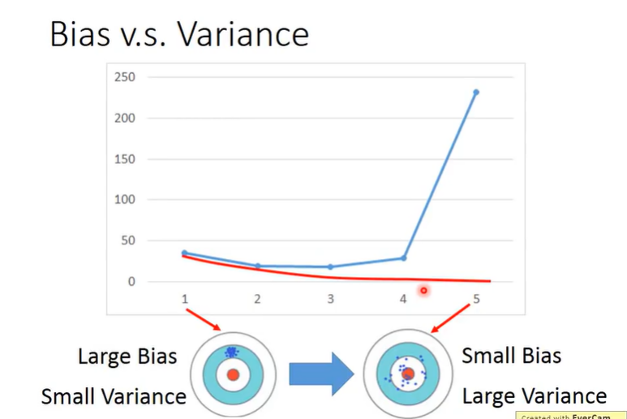
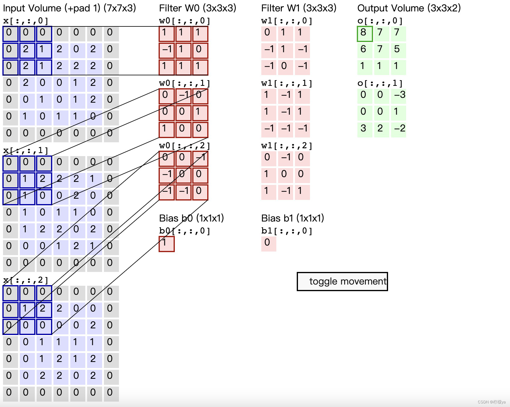
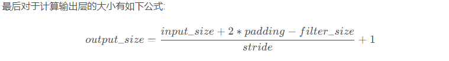
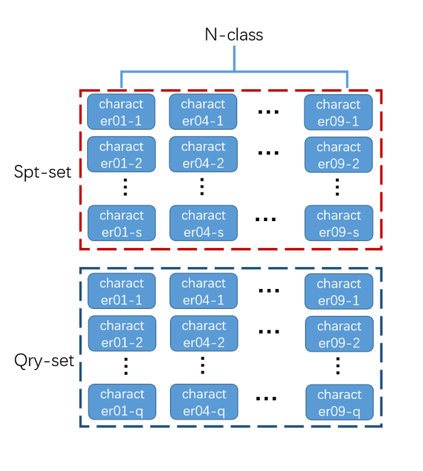

# 0. 常用语法
## Pytorch

View（）类似resize（），可以把矩阵转换为向量 感觉这个东西效率不高


**文件匹配glob**

读某个目录下的所有匹配文件

```python
file_list = [f for f in glob.glob(data_path + "**/character*", recursive=True)]  # 一个list,含所有文件
```

**抽样**

random.sample

```python
img_dirs = random.sample(file_list, n_way)  # 从所有character文件夹中选出N个
```

**enumerate()**

enumerate() 函数用于将一个可遍历的数据对象(如列表、元组或字符串)组合为一个索引序列，同时列出数据和数据下标，一般用在 for 循环当中。

```python
# 遍历一个list 
for label, img_dir in enumerate(img_dirs):

>>>seasons = ['Spring', 'Summer', 'Fall', 'Winter']
>>> list(enumerate(seasons))
[(0, 'Spring'), (1, 'Summer'), (2, 'Fall'), (3, 'Winter')]
>>> list(enumerate(seasons, start=1))       # 下标从 1 开始
[(1, 'Spring'), (2, 'Summer'), (3, 'Fall'), (4, 'Winter')]
>>> tuple(enumerate(seasons, start=1))
((1, 'Spring'), (2, 'Summer'), (3, 'Fall'), (4, 'Winter'))
```


# 数学

目标：找到一个函数解决问题。模型是函数的集合。通过损失函数作衡量指标筛选出最好的函数

#### 偏差和方差

使用过于复杂的模型（例如高次式），使得训练集ACC很高，但测试集ACC反倒降低，叫过拟合。但，错误是如何产生的？

Bias	偏差

Variance	方差



横轴是最高次项幂指数。两种极端，左侧是未拟合，右侧是过拟合。

- More data
- Regularization 正则化


#### lecture3 Gradient Descent

Loss func：L（$\theta$）

Learningrate，寻找极值点时，每次横移的幅度

Adam

SGD

只考虑某一部分样本的偏差，用它来更新参数。

Feature Scaling

可以放大特征，增大影响

#### lecture4  classification 

eg：能否找一个func：输入七种属性（10,300,20）-> 输出类别


> 有监督和无监督
- 有监督学习：对具有概念标记（分类）的训练样本进行学习，以尽可能对训练样本集外的数据进行标记（分类）预测。这里，所有的标记（分类）是已知的。因此，训练样本的岐义性低。
- 无监督学习：对没有概念标记（分类）的训练样本进行学习，以发现训练样本集中的结构性知识。这里，所有的标记（分类）是未知的。因此，训练样本的岐义性高。聚类就是典型的无监督学习


# CNN

### 1.[卷积神经网络](https://so.csdn.net/so/search?q=卷积神经网络&spm=1001.2101.3001.7020)介绍

卷积神经网络（Convolutional Neural Networks）是一类包含卷积计算且具有[深度](https://so.csdn.net/so/search?q=深度&spm=1001.2101.3001.7020)结构的前馈神经网络（Feedforward Neural Networks），是深度学习（deep learning）的代表算法之一。

### 2.卷积神经网络的结构

卷积神经网络一般包含如下几种结构，输入层，卷积层，池化层，激活函数，全链接层，输出层。

### 2.1 输入层

输入层简单说就是一个矩阵，该矩阵表示输入图片的像素点

### 2.2 卷积层

卷积层是卷积神经网络的关键所在。首先要明白几个概念，input_size表示输入的矩阵的大小，filter_size表示卷积核的大小，stride表示步长，padding表示填充。


卷积：与卷积核对应位置相乘再相加，填入新的矩阵的对应位置。卷积核每次向右移动stride步长



### 2.3 池化层

池化层分为两种，分别为平均池化和最大池化，最大池化目前用的更多一些，简单的说和卷积很类似，卷积是点乘求和，最大池化则是点乘求最大值，平均池化则是点乘求平均。


### 2.4全连接层


### 激活函数ReLu

```
3、ReLU 的函数表达式和导数表达式

ReLU 的函数表达式：

当 x <= 0 时，ReLU = 0

当 x > 0 时，ReLU = x


ReLU 的导数表达式：

当 x<= 0 时，导数为 0

当 x > 0 时，导数为 1

```


## **交叉熵**损失函数

https://zhuanlan.zhihu.com/p/98785902

```python
loss_func = torch.nn.CrossEntropyLoss()
```

### 什么是交叉熵？

> 回忆
>
> 信息量：它是用来衡量一个事件的不确定性的；一个事件发生的概率越大，不确定性越小，则它所携带的信息量就越小。
>
> $ I(x_0)=−log(p(x_0))$
>
> 熵：它是用来衡量一个系统的混乱程度的，代表一个系统中信息量的总和；信息量总和越大，表明这个系统不确定性就越大。

**交叉熵主要是用来判定实际的输出与期望的输出的接近程度**，为什么这么说呢，举个例子：在做分类的训练的时候，如果一个样本属于第K类，那么这个类别所对应的的输出节点的输出值应该为1，而其他节点的输出都为0，即[0,0,1,0,….0,0]，这个数组也就是样本的Label，是神经网络最期望的输出结果。也就是说用它来衡量网络的输出与标签的差异，利用这种差异经过反向传播去更新网络参数。

**交叉熵：**它主要刻画的是实际输出（概率）与期望输出（概率）的距离，也就是交叉熵的值越小，两个概率分布就越接近。假设概率分布p为期望输出，概率分布q为实际输出， H(p,q) 为交叉熵，则


$H(p,q)=−∑x(p(x)logq(x)+(1−p(x))log(1−q(x)))$


Pytorch实际使用的是另外一种方式计算：

https://blog.csdn.net/XIAOSHUCONG/article/details/123527257

# HelloWorld——MINIST

https://zhuanlan.zhihu.com/p/445381875

epoch = 10 正确率在0.7左右

model

```python
import torch.nn as nn
import torch.nn.functional as F

class Net(nn.Module):
    def __init__(self):
        super().__init__()
        self.net = nn.Sequential(
            nn.Conv2d(in_channels=1,out_channels=16,
                      kernel_size=(3,3),
                      stride=(1,1),
                      padding=1                     #MNIST是1x28x28
                      ),                            #16x28x28
            nn.MaxPool2d(kernel_size=2),            #16x14x14   每两个取一个大的作代替
            nn.Conv2d(16, 32, 3, 1, 1),             #32x14x14
            nn.MaxPool2d(2),                        #32x7x7
            nn.Flatten(),                           #??
            nn.Linear(32*7*7, 16),                  #全连接
            nn.ReLU(),
            nn.Linear(16,10)                        #16->10个数字

        )

    def forward(self,x):
        return self.net(x)


```

MNIST_train

```python
import torch
import torch.optim as optim
import torchvision
from torchvision import datasets, transforms
from torch.utils.data import DataLoader
from model import Net

# def show():
#     fig = plt.figure()
#     for i in range(20):
#         plt.subplot(5, 4, i + 1)
#         plt.tight_layout()
#         plt.imshow(example_data[i][0], cmap='gray', interpolation='none')
#         plt.title("{}".format(example_targets[i]))
#         plt.xticks([])
#         plt.yticks([])
#     plt.show()

#超参数
device = torch.device("cuda:0" if torch.cuda.is_available() else "cpu")

# BATCH_SIZE=512 #大概需要2G的显存
BATCH_SIZE=128
EPOCHS=10 # 总共训练批次
LEARNING_RATE = 0.1

#准备训练数据集
# train_data = torchvision.datasets.MNIST(root="data",download=True,train=True,
#                                         transform=torchvision.transforms.ToTensor())
# test_data = torchvision.datasets.MNIST(root="data",download=True,train=True,
#                                         transform=torchvision.transforms.ToTensor())
train_loader = torch.utils.data.DataLoader(
        datasets.MNIST('data', train=True, download=True,
                       transform=transforms.transforms.ToTensor()
                       ),
        batch_size=BATCH_SIZE, shuffle=True)

test_loader = torch.utils.data.DataLoader(
        datasets.MNIST('data', train=False,
                       transform=transforms.transforms.ToTensor()
                       ),
        batch_size=BATCH_SIZE, shuffle=True)


# #看看是什么东西
# examples = enumerate(train_loader)
# batch_idx, (example_data, example_targets) = next(examples)
# print(example_targets)
# print(example_data.shape)
# #绘制一下
# show()

model  = Net().to(device)#模型实例化
# model = torch.load("my_cnn.nn")
print(device)

#验证一下模型
i = torch.zeros((64, 1, 28, 28)).to(device)
o = model(i)
print(o.shape)
optimizer = optim.SGD(model.parameters(),lr=LEARNING_RATE) #简单的优化器_Adam  换成了SGD 不知道是啥
# 交叉熵损失函数
loss_func = torch.nn.CrossEntropyLoss()
#train
cnt = 0
for cnt in range (EPOCHS):
    for imgs, labels in train_loader:
        imgs = imgs.to(device)             #张量加载到显卡
        labels = labels.to(device)
        outputs = model(imgs)
        loss = loss_func(outputs, labels)
        optimizer.zero_grad()              #清空优化器梯度?
        loss.backward()
        optimizer.step()
    # 测试
    total_loss = 0
    with torch.no_grad():#不需要反向传播,不要自动求导
        for imgs, labels in test_loader:
            imgs, labels = imgs.to(device), labels.to(device)
            ouputs = model(imgs)
            loss = loss_func(ouputs, labels)
            total_loss += loss
    print("第{}次训练的Loss= {}".format(cnt+1, total_loss))

torch.save(model, "my_cnn.nn")
```

# Omniglot


#  ------------------
 
 
 > 超参数

train loss 下降，val loss下降，说明网络仍在学习； 奈斯，继续训练
train loss 下降，val loss上升，说明网络开始过拟合了；赶紧停止，然后数据增强、正则
train loss 不变，val loss不变，说明学习遇到瓶颈；调小学习率或批量数目
train loss 不变，val loss下降，说明数据集100%有问题；检查数据集标注有没有问题
train loss 上升，val loss上升，说明网络结构设计不当，训练超参数设置不当，数据集经过清洗等问题。


# GANormaly

异常检测：（区别于分类问题）异常检测问题中NG样本通常比较少，直接学习能区分NG样本的模型是很困难的。

所以：学习能区分OK样本的模型就好，只要跟OK长得不像的就认为是NG的。

自编码器==（Autoencoder）==是异常检测中比较经典的一种方法。它的解决思路是采用尽可能多的OK样本去学习一个自编码模型，由于该模型见过足够多的OK样本，因此它能够很好地将OK样本重建出来，而NG样本它是没见过的，因此它没法很好地重建出来。


同时学习“原图->重建图”和“原图的编码->重建图的编码”两个映射关系。这样，该方法不仅对生成的图片外观（图片->图片）做了的约束，也对图片内容（图片编码->图片编码）做了约束。

再加上GAN中对抗训练的思想。上述结构作为生成网络G-Net，又定义了一个判别网络D-Net，通过交替训练生成网络和对抗网络，最终学到一个比较好的生成网络。

推理时，用于推断的不是原图和重建图的差异，而是第一部分编码器产生的隐空间特征（原图的编码）和第二部分编码器产生的隐空间特征（重建图的编码）的差异。

#### 损失函数

三个网络，G-Net中的encoder1,2，D-net，需要三个损失函数。

#### 推断

用于推断的不是原图和重建图的差距，而是计算z'和z的差异。（使用编码损失进行推断：

网络收敛以后，计算所有健康样本的编码损失，取最大值作为判别阈值。推断时，给定一张图片，计算损失值，若小于这个阈值即为健康样本；反之则为异常样本。

这种方法使得模型对图片中的微小变化不敏感，减少了噪声的影响


# Bert-VITS2 

Bert-VITS2 ：

https://github.com/Stardust-minus/Bert-VITS2 

Fish Speech：

由 [Fish Audio](https://fish.audio/) 研发的基于 VQ-GAN 和 Llama 的多语种语音合成.

启动WEBUI：

```
python -m tools.webui \
    --llama-checkpoint-path "checkpoints/fish-speech-1.4" \
    --decoder-checkpoint-path "checkpoints/fish-speech-1.4/firefly-gan-vq-fsq-8x1024-21hz-generator.pth" \
    --decoder-config-name firefly_gan_vq
```

访问：

http://127.0.0.1:7860/?__theme=light


微调：

https://speech.fish.audio/zh/finetune/#1

https://huggingface.co/spaces/XzJosh/DZ-Bert-VITS2-2.3


>**什么是ZERO - SHOT**
>一句话定义：模型在完全没训练过某一任务的情况下，直接完成该任务。

| 方法                            | 训练数据     | 类比                    |
| ----------------------------- | -------- | --------------------- |
| **Supervised Learning**（监督学习） | 大量标注数据   | 老师教你100道题，再考试         |
| **Few-Shot Learning**（少样本学习）  | 几个例子     | 老师给你3道例题，再考类似题        |
| **One-Shot Learning**（单样本学习）  | 1个例子     | 老师给你1道例题，再考类似题        |
| **Zero-Shot Learning**（零样本学习） | **0个例子** | **直接考试，没例题，全靠你之前的知识** |


>在机器学习中，**"shot"** 指的是 **“示例”（example）**，可以理解成 **“给模型看的样本数量”**。


# 离线安装python包
下载：pip download -r requirements.txt --platform manylinux2014_aarch64 --only-binary=:all: --python-version 3.8 -d ./packages
